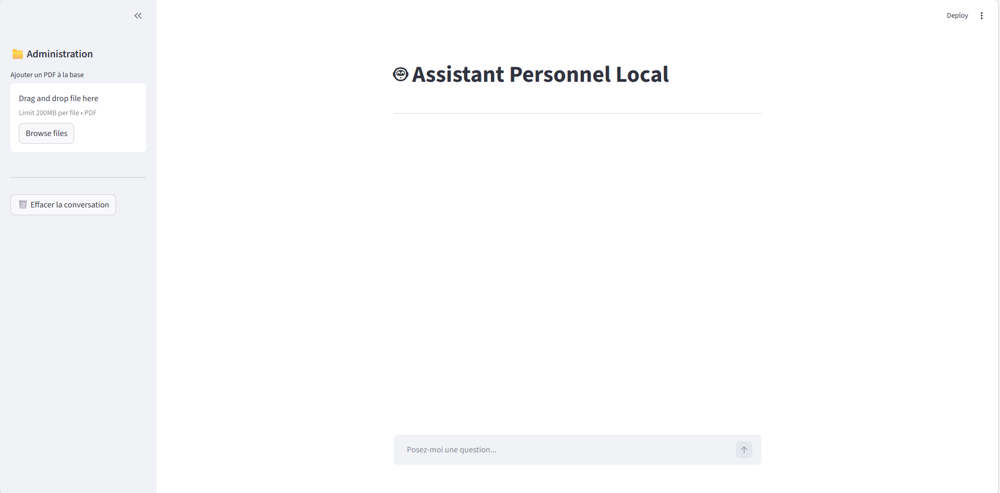

# 🤖 Assistant Personnel Local

Un assistant qui répond à tes questions en se basant sur tes propres documents PDF — le tout tourne en local, rien ne passe par internet.



---

## Pourquoi ce projet ?

J'avais besoin de pouvoir interroger des documents personnels sans les envoyer à OpenAI ou autre service cloud. L'idée était simple : glisser un PDF dans l'interface, poser une question, obtenir une réponse qui cite ses sources.

---

## Comment ça marche

Quand tu poses une question, l'app ne demande pas directement au LLM. Elle commence par chercher dans ta base de documents les passages les plus pertinents, puis les transmet au modèle avec ta question. Résultat : le modèle répond en se basant sur ce que toi tu lui as fourni, pas sur ce qu'il a mémorisé à l'entraînement.

```
Ton PDF
   │
   ▼
Découpage en chunks (800 caractères, overlap 80)
   │
   ▼
Transformation en vecteurs (mxbai-embed-large)
   │
   ▼
Stockage ChromaDB (local, persistant)
   │
   ▼ ← ta question arrive ici
Recherche des 3 chunks les plus proches
   │
   ▼
LLM (Mistral / Llama3) génère la réponse en streaming
```

---

## Stack

- **Ollama** — fait tourner les LLM en local (Mistral, Llama 3, Phi-3...)
- **LangChain** — orchestre le pipeline RAG
- **ChromaDB** — stocke les embeddings sur disque
- **Streamlit** — interface web minimaliste
- **Docker** — pour que ça tourne partout sans galère d'install

---

## Lancer le projet

### Avec Docker (recommandé)

```bash
git clone https://github.com/votre-user/assistant-local.git
cd assistant-local
docker compose up --build
```

Puis dans un second terminal, télécharger les modèles une seule fois :

```bash
docker exec -it rag_ollama ollama pull mistral
docker exec -it rag_ollama ollama pull mxbai-embed-large
```

Ouvrir [http://localhost:8501](http://localhost:8501)

### Sans Docker

```bash
pip install -r requirements.txt
ollama pull mistral && ollama pull mxbai-embed-large
streamlit run main.py
```

---

## Changer de modèle

Tout se passe dans `docker-compose.yml`, sans toucher au code :

```yaml
- LLM_MODEL=mistral     # ou llama3, gemma3, phi3, deepseek-r1
```

Puis `docker compose down && docker compose up`.

---

## Évaluation

Le fichier `evaluate.py` mesure la qualité du pipeline avec [RAGAS](https://github.com/explodinggradients/ragas) sur 4 métriques : fidélité des réponses, pertinence, précision et rappel du contexte récupéré.

```bash
python evaluate.py
```

Les résultats sont sauvegardés dans `eval_results.csv`.

---

## Structure

```
.
├── 5_app_visuelle.py              # app principale
├── evaluate.py          # évaluation RAGAS
├── Dockerfile
├── docker-compose.yml
├── requirements.txt
├── data/                # PDFs uploadés (ignoré par git)
└── ma_base/             # base ChromaDB (ignoré par git)
```

---

## Quelques choix techniques

**chunk_size=800** — environ 2-3 paragraphes, assez pour contenir une idée complète sans dépasser le contexte utile du LLM.

**k=3** — récupérer 3 chunks c'est ~2400 caractères de contexte. Au-delà, on dilue le signal pertinent et on sature la VRAM sur du matériel classique.

**mxbai-embed-large** — dans le top 5 du MTEB Leaderboard pour la recherche sémantique, bon en français et en anglais, taille raisonnable pour du local.